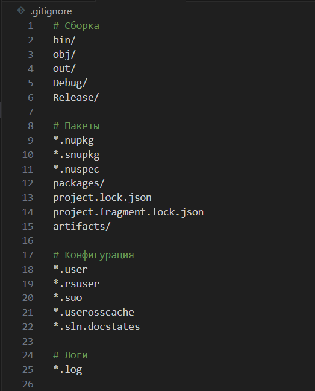
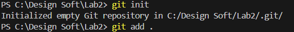
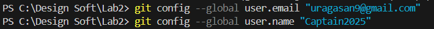
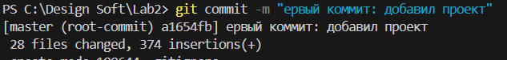
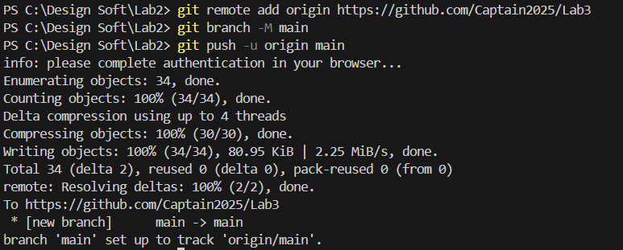

## Отчет по лабораторной работе №3

**Тема:** Настройка git

### Цель работы

Освоить базовые команды работы с системой контроля версий Git, а также настроить синхронизацию локального репозитория с GitHub.

---
Создай файл `.gitignore` в корне проекта

### Ход выполнения

#### 1. Инициализация репозитория и добавление файлов

Выполнена команда для инициализации Git-репозитория и добавления всех файлов проекта:

#### 2. Настройка данных пользователя

Выполнена настройка имени и email пользователя для глобальных коммитов:

#### 3. Создание первого коммита

Сделан первый коммит, содержащий все файлы проекта и файл `.gitignore`:

#### 4. Связь локального репозитория с GitHub и отправка изменений

Создан репозиторий на GitHub и привязан к локальному с помощью команды `git remote add origin`.  
После этого проект был загружен на удалённый сервер:

### Заключение

В ходе лабораторной работы были изучены и применены базовые команды Git:

- инициализация репозитория (`git init`),
    
- настройка пользователя (`git config`),
    
- добавление файлов и создание коммита (`git add`, `git commit`),
    
- настройка связи с удалённым репозиторием и отправка данных на GitHub (`git remote add`, `git push`).
    

Теперь проект доступен на GitHub и готов для дальнейшей работы с системой контроля версий.
